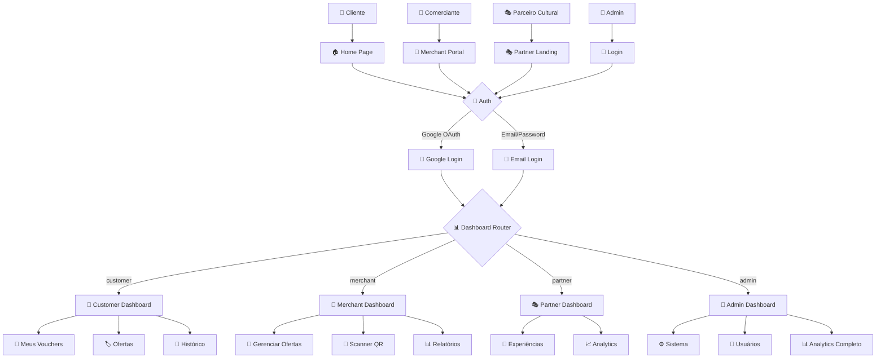
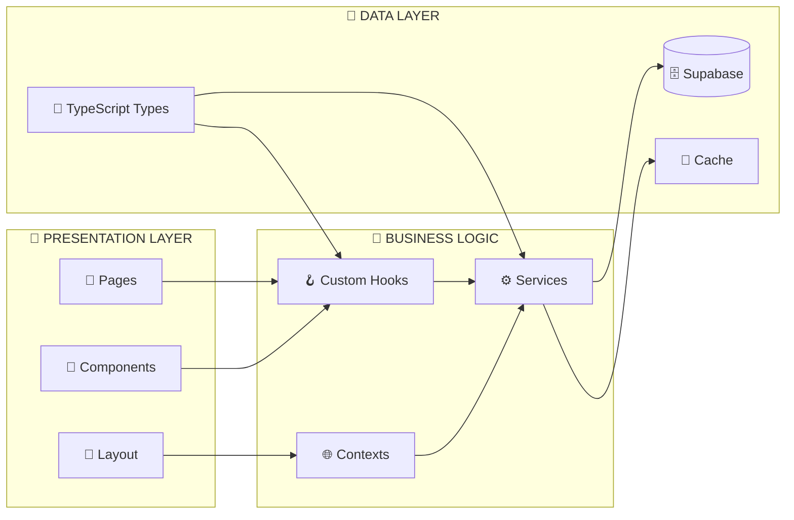
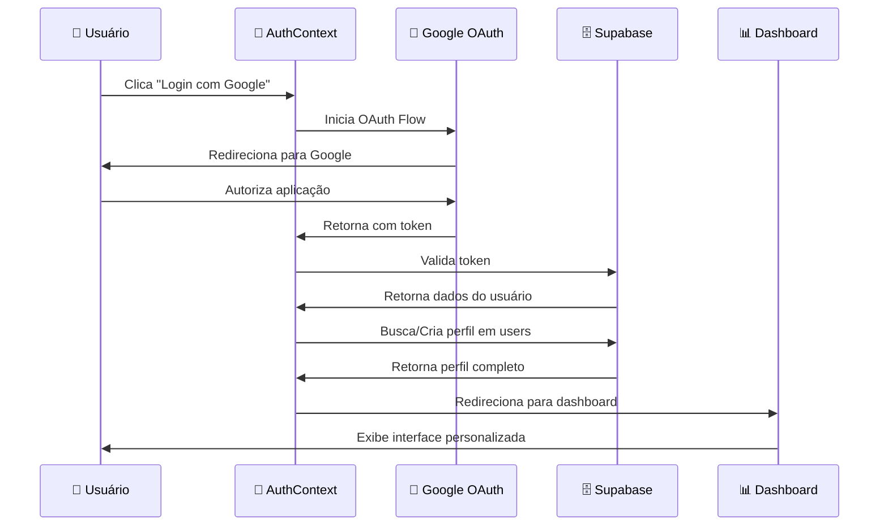
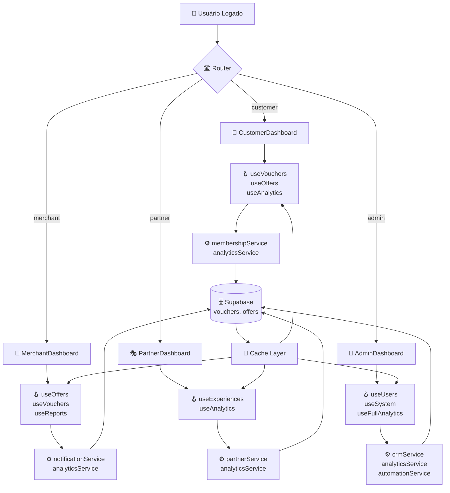
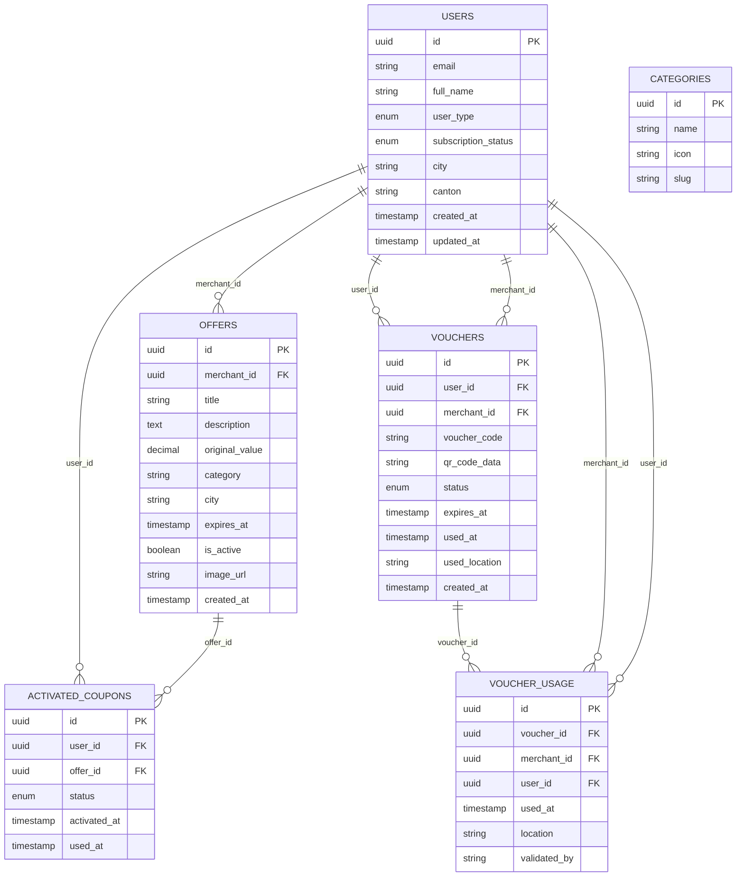
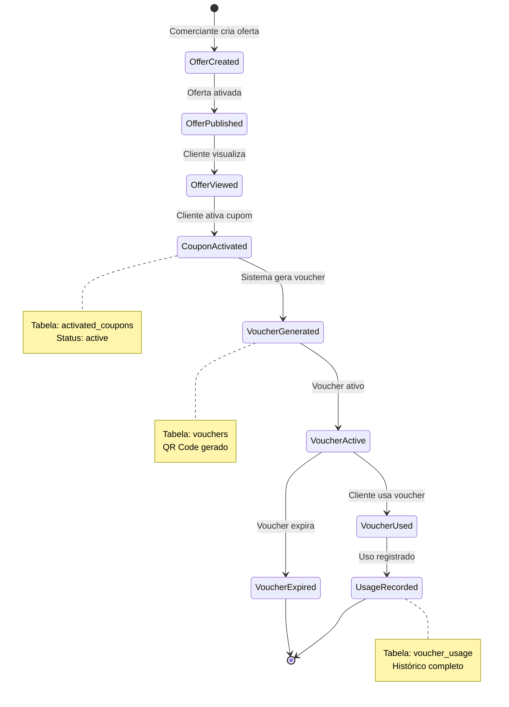
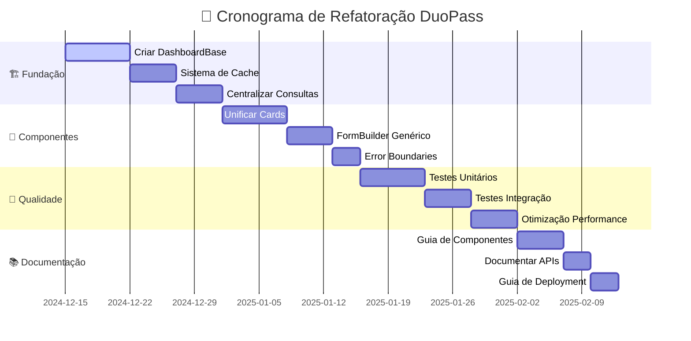

# 🗺️ DIAGRAMA DE FLUXO - ARQUITETURA DUOPASS

## 🎯 VISÃO GERAL DO SISTEMA



---

## 🏗️ ARQUITETURA DE COMPONENTES



---

## 🔄 FLUXO DE AUTENTICAÇÃO



---

## 📊 FLUXO DE DADOS - DASHBOARDS



---

## 🗄️ ESTRUTURA DO BANCO DE DADOS



---

## 🔄 FLUXO DE VOUCHER (CICLO COMPLETO)



---

## 🧩 MAPA DE COMPONENTES DUPLICADOS

```mermaid
graph TB
    %% Componentes Base
    subgraph "🎯 COMPONENTES ALVO PARA UNIFICAÇÃO"
        BASE_DASHBOARD[📊 BaseDashboard]
        BASE_CARD[🃏 BaseCard]
        BASE_FORM[📝 BaseForm]
        BASE_TABLE[📋 BaseTable]
    end
    
    %% Dashboards Atuais
    subgraph "📊 DASHBOARDS ATUAIS (DUPLICADOS)"
        CD2[📱 CustomerDashboard]
        MD2[🏪 MerchantDashboard]
        PD2[🎭 PartnerDashboard]
        AD2[👑 AdminDashboard]
        COMM[📢 CommunicationDashboard]
    end
    
    %% Cards Atuais
    subgraph "🃏 CARDS ATUAIS (SIMILARES)"
        OFFER_CARD[🏷️ OfferCard]
        VOUCHER_CARD[🎫 VoucherCard]
        EXPERIENCE_CARD[🎨 ExperienceCard]
        USER_CARD[👤 UserCard]
    end
    
    %% Formulários Atuais
    subgraph "📝 FORMS ATUAIS (REPETITIVOS)"
        OFFER_FORM[📝 OfferForm]
        VOUCHER_FORM[📝 VoucherForm]
        USER_FORM[📝 UserForm]
        CONTACT_FORM[📝 ContactForm]
    end
    
    %% Unificação
    BASE_DASHBOARD -.->|substitui| CD2
    BASE_DASHBOARD -.->|substitui| MD2
    BASE_DASHBOARD -.->|substitui| PD2
    BASE_DASHBOARD -.->|substitui| AD2
    BASE_DASHBOARD -.->|substitui| COMM
    
    BASE_CARD -.->|substitui| OFFER_CARD
    BASE_CARD -.->|substitui| VOUCHER_CARD
    BASE_CARD -.->|substitui| EXPERIENCE_CARD
    BASE_CARD -.->|substitui| USER_CARD
    
    BASE_FORM -.->|substitui| OFFER_FORM
    BASE_FORM -.->|substitui| VOUCHER_FORM
    BASE_FORM -.->|substitui| USER_FORM
    BASE_FORM -.->|substitui| CONTACT_FORM
```



---

## 🚀 ROADMAP DE REFATORAÇÃO



---

## 📊 MÉTRICAS DE IMPACTO

```mermaid
xychart-beta
    title "📈 Impacto Esperado da Refatoração"
    x-axis ["Antes", "Depois"]
    y-axis "Percentual" 0 --> 100
    bar [30, 10] %% Duplicação de Código
    bar [0, 80]  %% Cobertura de Testes
    bar [60, 90] %% Manutenibilidade
    bar [70, 95] %% Performance
```



---

## 🎯 CONCLUSÃO VISUAL

### ✅ Estado Atual
```
🏗️ ARQUITETURA: Sólida mas com duplicações
📊 DASHBOARDS: 5 componentes similares
🔄 FLUXOS: Bem definidos
🗄️ BANCO: Estrutura robusta
📝 DOCS: Abrangente
```

### 🚀 Estado Futuro (Pós-Refatoração)
```
🏗️ ARQUITETURA: Otimizada e DRY
📊 DASHBOARDS: 1 componente base + configs
🔄 FLUXOS: Mantidos e otimizados
🗄️ BANCO: Inalterado
📝 DOCS: Expandida com guias técnicos
```

---

**📝 Diagramas gerados em:** Dezembro 2024  
**🔄 Próxima atualização:** Após refatoração  
**👨‍💻 Responsável:** Agente DuoPass AI