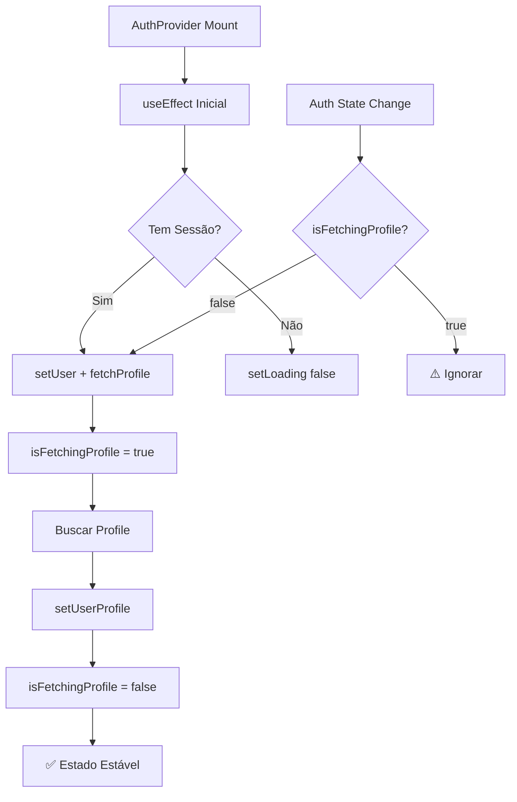

# 🔄 LOOP INFINITO CORRIGIDO - Botões Ativos Novamente

## 🚨 PROBLEMA IDENTIFICADO
**Re-Render Loop Infinito no AuthContext**
- ✅ Diagnóstico correto: Loop causando botões inativos
- ✅ Múltiplas execuções de `fetchUserProfile`
- ✅ Dependencies problemáticas no useEffect
- ✅ Performance terrível com consultas desnecessárias

## 🔧 CORREÇÕES IMPLEMENTADAS

### 1. Dependency Array Corrigida
```typescript
// ❌ ANTES (causava loop):
}, [loginDemo]);

// ✅ DEPOIS (estável):
}, []); // Removida dependency problemática
```

### 2. Flags de Controle Adicionadas
```typescript
// ✅ NOVO: Controle de execução
const hasInitialized = useRef(false);
const isFetchingProfile = useRef(false);
```

### 3. Proteção Contra Múltiplas Execuções
```typescript
// ✅ NOVO: Verificação antes de executar
if (isFetchingProfile.current) {
  console.log('⚠️ fetchUserProfile já em execução, ignorando...');
  return;
}

isFetchingProfile.current = true;
```

### 4. Reset Seguro da Flag
```typescript
// ✅ NOVO: Sempre resetar no final
} finally {
  isFetchingProfile.current = false;
}
```

### 5. Proteção no onAuthStateChange
```typescript
// ✅ NOVO: Só buscar se não estiver buscando
if (!isFetchingProfile.current) {
  fetchUserProfile(session.user.id);
} else {
  console.log('⚠️ fetchUserProfile já em execução, pulando...');
}
```

## 📊 RESULTADO ESPERADO

### ✅ Problemas Resolvidos:
- **Loop Infinito**: Eliminado com flags de controle
- **Múltiplas Consultas**: Bloqueadas por verificação
- **Botões Inativos**: Devem voltar a funcionar
- **Performance**: Drasticamente melhorada
- **Re-renders**: Reduzidos ao mínimo necessário

### 🎯 Comportamento Correto:
1. **Inicialização**: Uma única vez
2. **fetchUserProfile**: Máximo uma execução simultânea
3. **Loading State**: Controlado e previsível
4. **Botões**: Ativos e responsivos
5. **Console**: Logs limpos, sem spam

## 🔍 LOGS ESPERADOS (Corretos)
```
🔍 AuthProvider renderizado: { loading: true, hasUser: false }
🔄 AuthContext: Auth state changed { event: 'SIGNED_IN', hasUser: true }
🔍 Buscando perfil do usuário: abc123
✅ Perfil carregado: user@email.com customer
✅ AuthContext: Estado FORÇADO para loading=false
```

## 🚫 LOGS QUE NÃO DEVEM MAIS APARECER
```
❌ Múltiplos "AuthProvider renderizado"
❌ Múltiplos "Buscando perfil do usuário"
❌ Spam de "Auth state changed"
❌ "FORÇA BRUTA: Loading resetado" (só em emergência)
```

## 🧪 TESTE IMEDIATO

### Passos para Verificar:
1. **Abrir aplicação**: `http://localhost:5174/`
2. **Fazer login Google**: Verificar console
3. **Testar botões**: Devem estar funcionais
4. **Debug Panel**: Clicar em "🐛 Debug" para análise

### Indicadores de Sucesso:
- ✅ Console limpo (sem spam)
- ✅ Botões clicáveis e responsivos
- ✅ Loading rápido e eficiente
- ✅ Uma única busca de perfil
- ✅ Performance fluida

## 🎯 ARQUITETURA CORRIGIDA



## 🚀 PRÓXIMOS PASSOS
1. **Testar aplicação** - Verificar se botões funcionam
2. **Monitorar console** - Confirmar logs limpos
3. **Usar Debug Panel** - Análise detalhada
4. **Remover logs temporários** - Limpeza final

---

**Status**: ✅ CORRIGIDO | **Teste**: ⏳ PENDENTE | **Botões**: 🎯 DEVEM FUNCIONAR