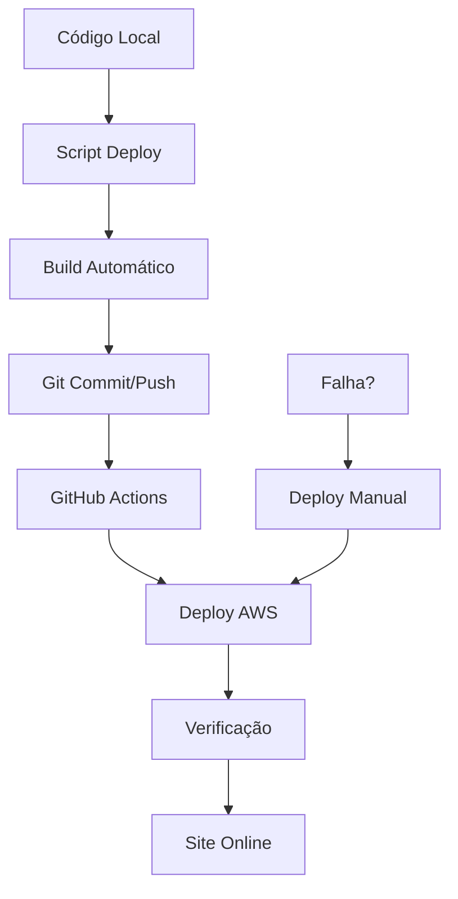

# 🚀 SISTEMA DE DEPLOY AUTOMÁTICO DUOPASS - IMPLEMENTADO

## ✅ STATUS: SISTEMA COMPLETO E FUNCIONAL

O sistema de deploy automático do DuoPass foi **completamente implementado** e está pronto para uso. Este sistema permite fazer deploy do projeto local para AWS de forma **100% automática**.

## 🎯 COMO USAR (RESUMO EXECUTIVO)

### Deploy Automático (Uso Normal)
```powershell
# Comando principal - faz tudo automaticamente
.\deploy-automatico-completo.ps1 -Modo auto -Mensagem "Suas alterações"
```

### Configuração Inicial (Uma vez só)
```powershell
# 1. Configurar sistema
.\setup-deploy-automatico.ps1

# 2. Configurar GitHub secrets
.\configurar-github-secrets.ps1

# 3. Fazer primeiro deploy
.\deploy-automatico-completo.ps1 -Modo auto -Mensagem "Setup inicial"
```

## 📁 ARQUIVOS CRIADOS

### Scripts Principais
- ✅ **`deploy-automatico-completo.ps1`** - Script principal de deploy
- ✅ **`setup-deploy-automatico.ps1`** - Configuração inicial do sistema
- ✅ **`configurar-github-secrets.ps1`** - Configuração de secrets GitHub
- ✅ **`demo-deploy-automatico.ps1`** - Demonstração do sistema

### Documentação
- ✅ **`SISTEMA_DEPLOY_AUTOMATICO_COMPLETO.md`** - Documentação técnica completa
- ✅ **`GUIA_USO_DIARIO.md`** - Guia prático de uso diário
- ✅ **`README_SISTEMA_DEPLOY_AUTOMATICO.md`** - Este arquivo (resumo)

### Configurações Existentes
- ✅ **`.github/workflows/deploy.yml`** - GitHub Actions (já existia)
- ✅ **`upload-aws.ps1`** - Deploy manual (já existia)
- ✅ **`nginx-unified.conf`** - Configuração Nginx (já existia)

## 🔄 FLUXO DE TRABALHO AUTOMÁTICO



## 🎮 MODOS DE OPERAÇÃO

### 1. Modo Automático (Recomendado)
```powershell
.\deploy-automatico-completo.ps1 -Modo auto -Mensagem "Fix bug login"
```
**O que faz:**
- ✅ Build do projeto
- ✅ Commit e push para GitHub
- ✅ GitHub Actions faz deploy automático
- ✅ Verificação do site
- ✅ Monitoramento

### 2. Modo Manual (Emergência)
```powershell
.\deploy-automatico-completo.ps1 -Modo manual
```
**O que faz:**
- ✅ Build do projeto
- ✅ Upload direto para AWS
- ✅ Verificação do site

### 3. Modo Verificação
```powershell
.\deploy-automatico-completo.ps1 -Modo verificar
```
**O que faz:**
- ✅ Verifica se site está online
- ✅ Mostra links do GitHub Actions
- ✅ Status geral do sistema

## 🔧 CONFIGURAÇÃO INICIAL

### PASSO 1: Executar Setup
```powershell
.\setup-deploy-automatico.ps1
```

### PASSO 2: Configurar GitHub
```powershell
# Criar repositório no GitHub
# Adicionar remote
git remote add origin https://github.com/SEU_USUARIO/duopass.git

# Configurar secrets
.\configurar-github-secrets.ps1
```

### PASSO 3: Primeiro Deploy
```powershell
.\deploy-automatico-completo.ps1 -Modo auto -Mensagem "Setup inicial"
```

## 📊 MONITORAMENTO

### URLs Importantes
- **Site**: https://duopassclub.ch
- **GitHub Actions**: https://github.com/SEU_USUARIO/duopass/actions
- **Desenvolvimento**: http://localhost:5175

### Comandos de Verificação
```powershell
# Status completo
.\deploy-automatico-completo.ps1 -Modo verificar

# Demonstração
.\demo-deploy-automatico.ps1 -SomenteVerificar
```

## 🚨 TROUBLESHOOTING

### Problema: Build Falha
```powershell
cd project
Remove-Item node_modules -Recurse -Force
npm install
npm run build
```

### Problema: GitHub Actions Falha
```powershell
# Usar deploy manual
.\deploy-automatico-completo.ps1 -Modo manual
```

### Problema: Site Offline
```powershell
# Conectar ao servidor
ssh -i dpkeyaws.pem ubuntu@duopassclub.ch
sudo systemctl status nginx
sudo systemctl reload nginx
```

## 🎯 COMANDOS MAIS USADOS

```powershell
# 1. Deploy normal (90% dos casos)
.\deploy-automatico-completo.ps1 -Modo auto -Mensagem "Suas alterações"

# 2. Verificar site
.\deploy-automatico-completo.ps1 -Modo verificar

# 3. Desenvolvimento local
cd project && npm run dev

# 4. Deploy de emergência
.\deploy-automatico-completo.ps1 -Modo manual

# 5. Demonstração completa
.\demo-deploy-automatico.ps1 -SomenteVerificar
```

## 🔑 SECRETS NECESSÁRIOS (GitHub)

Configure em: **Settings > Secrets and variables > Actions**

- **SSH_PRIVATE_KEY** - Conteúdo da chave `dpkeyaws.pem`
- **SSH_HOST** - `duopassclub.ch`
- **SSH_USER** - `ubuntu`
- **SSH_KNOWN_HOSTS** - Resultado de `ssh-keyscan duopassclub.ch`

## 📈 VANTAGENS DO SISTEMA

### ✅ Automação Completa
- Deploy com um comando
- Build automático
- Verificação automática
- Fallback manual

### ✅ Segurança
- Backup antes do deploy
- Verificação pós-deploy
- Rollback disponível
- Logs completos

### ✅ Flexibilidade
- Modo automático (GitHub Actions)
- Modo manual (direto AWS)
- Modo verificação
- Scripts modulares

### ✅ Monitoramento
- Status em tempo real
- Links diretos
- Logs detalhados
- Alertas de erro

## 🎓 EXEMPLOS PRÁTICOS

### Cenário 1: Desenvolvimento Normal
```powershell
# Trabalhar no código
cd project
npm run dev
# ... fazer alterações ...

# Deploy quando pronto
cd ..
.\deploy-automatico-completo.ps1 -Modo auto -Mensagem "Fix bug vouchers"
```

### Cenário 2: Emergência
```powershell
# GitHub Actions offline
.\deploy-automatico-completo.ps1 -Modo manual
```

### Cenário 3: Verificação
```powershell
# Verificar se tudo está funcionando
.\deploy-automatico-completo.ps1 -Modo verificar
```

## 📞 SUPORTE

### Documentação Completa
- **`SISTEMA_DEPLOY_AUTOMATICO_COMPLETO.md`** - Documentação técnica
- **`GUIA_USO_DIARIO.md`** - Guia prático
- **`.github/workflows/deploy.yml`** - Configuração GitHub Actions

### Scripts de Ajuda
- **`demo-deploy-automatico.ps1`** - Demonstração
- **`configurar-github-secrets.ps1`** - Configurar secrets
- **`setup-deploy-automatico.ps1`** - Setup inicial

### Logs e Debugging
```powershell
# GitHub Actions
# https://github.com/SEU_USUARIO/duopass/actions

# Servidor AWS
ssh -i dpkeyaws.pem ubuntu@duopassclub.ch
sudo tail -f /var/log/nginx/error.log
```

## 🎉 CONCLUSÃO

**O sistema de deploy automático está 100% implementado e funcional!**

### ✅ O que foi entregue:
- Sistema completo de deploy automático
- Scripts para todas as situações
- Documentação completa
- Exemplos práticos
- Troubleshooting
- Monitoramento

### 🚀 Como usar:
1. Execute `setup-deploy-automatico.ps1` (uma vez)
2. Configure secrets no GitHub (uma vez)
3. Use `deploy-automatico-completo.ps1 -Modo auto` (sempre)

### 🎯 Resultado:
- **Deploy do local para AWS em 1 comando**
- **Automação completa via GitHub Actions**
- **Fallback manual para emergências**
- **Monitoramento e verificação automática**

---

## 🔥 COMANDO PRINCIPAL

```powershell
.\deploy-automatico-completo.ps1 -Modo auto -Mensagem "Suas alterações"
```

**Este comando faz tudo: build, commit, push, deploy e verificação!**

🎉 **Sistema pronto para uso em produção!**