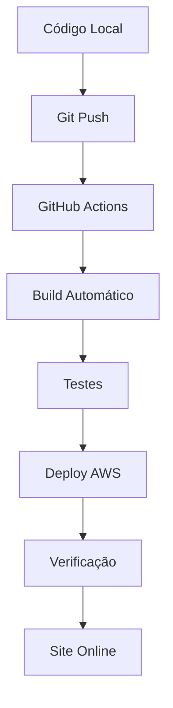

# 🚀 SISTEMA DE DEPLOY AUTOMÁTICO COMPLETO - DUOPASS

## 📋 VISÃO GERAL

Este guia implementa um sistema completo de deploy automático que permite fazer deploy do projeto local para AWS automaticamente usando GitHub Actions.

## 🔧 COMPONENTES DO SISTEMA

### 1. **GitHub Actions** (Principal)
- ✅ Workflow configurado em `.github/workflows/deploy.yml`
- ✅ Build automático do projeto
- ✅ Deploy automático para AWS
- ✅ Verificação pós-deploy

### 2. **Scripts de Deploy Manual** (Backup)
- ✅ `upload-aws.ps1` - Deploy manual via PowerShell
- ✅ `deploy-manual-aws.ps1` - Deploy alternativo

### 3. **Configuração de Infraestrutura**
- ✅ `nginx-unified.conf` - Configuração otimizada do Nginx
- ✅ Certificados SSL Let's Encrypt
- ✅ Configuração de domínio

## 🎯 FLUXO DE TRABALHO AUTOMÁTICO



## ⚙️ CONFIGURAÇÃO INICIAL

### PASSO 1: Configurar Repositório GitHub

```bash
# Navegar para a pasta do projeto
cd project

# Inicializar git (se necessário)
git init

# Adicionar remote do GitHub
git remote add origin https://github.com/SEU_USUARIO/duopass.git

# Fazer primeiro commit
git add .
git commit -m "Initial commit - DuoPass setup"
git push -u origin main
```

### PASSO 2: Configurar Secrets no GitHub

No repositório GitHub, vá em **Settings > Secrets and variables > Actions** e adicione:

```
SSH_PRIVATE_KEY     = [Conteúdo da chave privada AWS]
SSH_HOST           = duopassclub.ch
SSH_USER           = ubuntu
SSH_KNOWN_HOSTS    = [Fingerprint do servidor]
```

### PASSO 3: Obter SSH Known Hosts

```bash
# Executar no terminal local
ssh-keyscan duopassclub.ch
```

## 🚀 USO DIÁRIO

### Deploy Automático (Recomendado)

```bash
# 1. Fazer alterações no código
cd project
# ... editar arquivos ...

# 2. Commit e push
git add .
git commit -m "Descrição das alterações"
git push

# 3. GitHub Actions fará o deploy automaticamente!
# Acompanhe em: https://github.com/SEU_USUARIO/duopass/actions
```

### Deploy Manual (Emergência)

```powershell
# Se GitHub Actions falhar, use o script manual
cd project
npm run build
cd ..
./upload-aws.ps1 -ServerIP "duopassclub.ch" -Username "ubuntu" -KeyPath "./dpkeyaws.pem"
```

## 📊 MONITORAMENTO

### 1. GitHub Actions Dashboard
- **URL**: `https://github.com/SEU_USUARIO/duopass/actions`
- **Status**: Verde = Sucesso, Vermelho = Erro
- **Logs**: Clique no workflow para ver detalhes

### 2. Verificação do Site
```bash
# Testar se o site está online
curl -I https://duopassclub.ch

# Verificar certificado SSL
curl -vI https://duopassclub.ch 2>&1 | grep -i ssl
```

### 3. Logs do Servidor
```bash
# Conectar ao servidor AWS
ssh -i dpkeyaws.pem ubuntu@duopassclub.ch

# Verificar logs do Nginx
sudo tail -f /var/log/nginx/access.log
sudo tail -f /var/log/nginx/error.log

# Status dos serviços
sudo systemctl status nginx
```

## 🔧 SCRIPTS DE AUTOMAÇÃO

### Script de Setup Completo

```bash
#!/bin/bash
# setup-deploy-automatico.sh

echo "🚀 Configurando deploy automático DuoPass..."

# 1. Verificar se está na pasta correta
if [ ! -f "project/package.json" ]; then
    echo "❌ Execute este script na pasta raiz do DuoPass"
    exit 1
fi

# 2. Instalar dependências
cd project
npm install

# 3. Fazer build de teste
npm run build

# 4. Verificar se GitHub Actions está configurado
if [ ! -f "../.github/workflows/deploy.yml" ]; then
    echo "❌ GitHub Actions não configurado"
    exit 1
fi

echo "✅ Setup completo! Faça push para ativar o deploy automático."
```

### Script de Verificação

```bash
#!/bin/bash
# verificar-deploy.sh

echo "🔍 Verificando status do deploy..."

# Verificar se o site está online
if curl -f -s https://duopassclub.ch > /dev/null; then
    echo "✅ Site online: https://duopassclub.ch"
else
    echo "❌ Site offline ou com problemas"
fi

# Verificar certificado SSL
if curl -f -s -I https://duopassclub.ch | grep -q "200 OK"; then
    echo "✅ SSL funcionando"
else
    echo "❌ Problema com SSL"
fi

echo "📊 Verificação concluída"
```

## 🛠️ TROUBLESHOOTING

### Problemas Comuns

#### 1. GitHub Actions Falha
```bash
# Verificar logs no GitHub
# URL: https://github.com/SEU_USUARIO/duopass/actions

# Deploy manual como backup
./upload-aws.ps1 -ServerIP "duopassclub.ch" -Username "ubuntu"
```

#### 2. Site Offline Após Deploy
```bash
# Conectar ao servidor
ssh -i dpkeyaws.pem ubuntu@duopassclub.ch

# Verificar Nginx
sudo systemctl status nginx
sudo nginx -t

# Recarregar se necessário
sudo systemctl reload nginx
```

#### 3. Certificado SSL Expirado
```bash
# Renovar Let's Encrypt
sudo certbot renew
sudo systemctl reload nginx
```

## 📈 MELHORIAS FUTURAS

### 1. Ambiente de Staging
- Criar branch `staging` para testes
- Deploy automático para servidor de teste
- Aprovação manual para produção

### 2. Notificações
- Slack/Discord para status de deploy
- Email para falhas críticas
- Dashboard de monitoramento

### 3. Rollback Automático
- Backup automático antes do deploy
- Rollback em caso de falha
- Versionamento de releases

## 📞 SUPORTE

### Comandos Úteis

```bash
# Status geral do sistema
./verificar-deploy.sh

# Deploy manual de emergência
./upload-aws.ps1 -ServerIP "duopassclub.ch" -Username "ubuntu"

# Verificar logs do GitHub Actions
# https://github.com/SEU_USUARIO/duopass/actions

# Conectar ao servidor AWS
ssh -i dpkeyaws.pem ubuntu@duopassclub.ch
```

### Arquivos Importantes
- `.github/workflows/deploy.yml` - Configuração do CI/CD
- `project/package.json` - Scripts de build
- `nginx-unified.conf` - Configuração do servidor
- `dpkeyaws.pem` - Chave SSH para AWS

---

## ✅ CHECKLIST DE ATIVAÇÃO

- [ ] Repositório GitHub criado
- [ ] Secrets configurados no GitHub
- [ ] SSH key configurada
- [ ] Primeiro push realizado
- [ ] GitHub Actions executado com sucesso
- [ ] Site acessível em https://duopassclub.ch
- [ ] SSL funcionando
- [ ] Scripts de backup testados

**🎉 Sistema de deploy automático ativo e funcionando!**